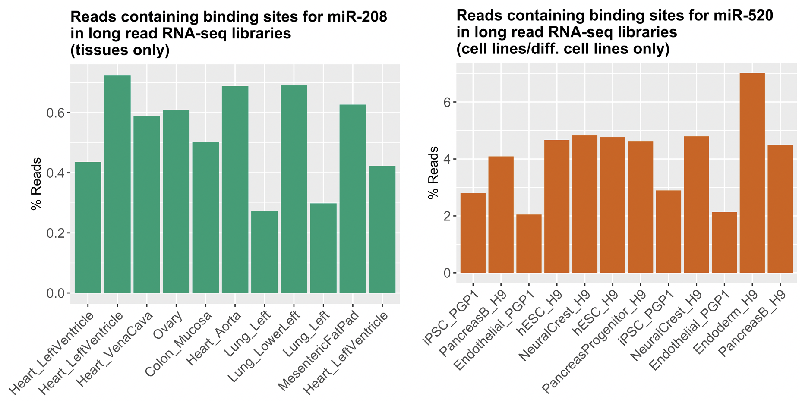
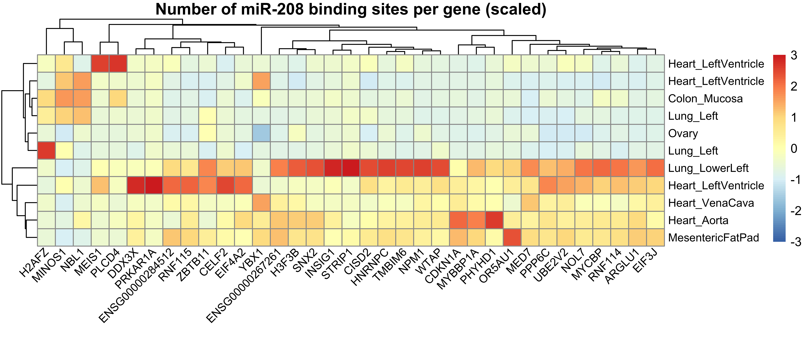

##  Final Project Report
#### Elisabeth Rebboah
#### Eco Evo 282
#### December 16, 2020
***
## Methods
### MicroRNA
MicroRNA-seq is a form of RNA-seq that captures small RNAs using an adaptor that binds specifically to their 3' hydroxyl group, as opposed to mRNA-seq that often relies on a 3' poly-A tail.


The libraries are processed by trimming the adapters on the 3' and 5' ends using cutadapt, then  mapped to the genome and quantified using STAR. The tsv files containing quantifications for 152 human microRNA-seq libraries available on the [ENCODE website](https://www.encodeproject.org/matrix/?type=Experiment&status=released&perturbed=false&assay_title=microRNA-seq&replicates.library.biosample.donor.organism.scientific_name=Homo+sapiens&award.rfa=ENCODE3&award.rfa=ENCODE4&perturbed=true&status=submitted) were downloaded. A metadata file (data/metadata_oct2020.csv) was used to combine the libraries into one counts matrix of 152 samples by 1,881 microRNAs (hg38 GENCODE v29). Counts were also converted to CPM and filtered such that each microRNA had at least 2 CPM in at least one sample, leaving 1,055 microRNAs. The scripts used to generate counts matrices and CPM matrices are code/analysis/make_counts_matrices.R and make_cpm_matrices.R, respectively, and the csv files can be found in data/processed. 

Principal component analyis (PCA) was run on the CPM>2 matrix containing all samples, as well as on tissues and cell lines/differentiated cell lines. In order to represent more variance and have a better understanding of the clusters, a non-linear dimensionality reduction method called Uniform Manifold Approximation and Projection (UMAP) was also implemented on the counts matrices via the Seurat workflow. The script used to generate PCA and UMAP plots can be found at code/analysis/pca_umap_figures.R.     

Differential expression (DE) analysis using edgeR was carried out on heart tissue compared to all other tissues and iPSC/hESC compared to all other cell line/diff. cell lines. Different p-value/log fold change cutoffs were used in the two volcano plots to be visually appealing; full edgeR results can be found in data/processed. 

### Integration with long read RNA
The long read RNA-seq libraries that match (were built from the same RNA) as microRNA-seq libraries were found using the metadata file. The building/submission of long-read libraries and microRNA-seq libraries is ongoing; samples where the long-read libraries are not yet submitted are labeled "waiting" in the stacked bar plots made using code/analysis/stacked_barplot_matchingPB.R. Bam files for the 23 matching samples were downloaded from the ENCODE website.

The script code/scripts/find_binding_sites_from_bam_TISSUES.sh was used to find long reads containing a microRNA binding site for a microRNA of interest. Awk filters the predicted targets database file (data/Predicted_Target_Locations.default_predictions.hg38.named.bed) for a specific microRNA, then bedtools intersect finds the reads from each library that overlap with a binding site. The script outputs the filtered database file, the number of reads containing a binding site and total number, and bed files containing the genomic location of the long reads overlapping a binding site. The bash script calls an R script to make simple bar plots of the fraction of reads with a specific microRNA binding site per long read RNA-seq library. The process is the same for code/scripts/find_binding_sites_from_bam_LINES.sh. 

To run:
```
bash find_binding_sites_from_bam_TISSUES.sh 208
```

To investigate the long reads that contained a miR-208 binding site, the bed files output from the bash script were input into the online tool [GREAT](http://great.stanford.edu/public/html/) to annotate each genomic location with its single nearest gene, and a heatmap was made from the number of binding sites per gene per long read library using code/analysis/miR208_heatmap_genes.R.

## Results
PCA of all 152 samples shows that samples mainly cluster together based on if the RNA was isolated from from tissues versus cell lines and differentiated cell lines. This could be caused by differing RNA quality between samples; due to the experimental processing, microRNA-seq performs better on high-quality (RIN>8) RNA. In comparison, the UMAP clusters are more tightly grouped by tissue type.


The differentially expressed microRNAs are indicated in the following volcano plots. Using the same p-value cutoff of 0.01 and a log fold change cutoff of 2, there were 57 differentially expressed microRNAs in the heart vs. all tisses and 197 differentially expressed microRNAs in stem cells vs. all cell lines/diff. cell lines. 


There are 11 matching tissue long-read libraries, mostly from heart, and 12 matching cell line long read libraries.


A heart left ventricle sample had the highest percentage of reads containing a miR-208 binding site, followed by aorta and lower left lung. The H9-derived endoderm sample had the highest percentage of reads containing a miR-520 binding site.





## Discussion
As an exploratory analysis, all microRNA-seq samples were projected in low-dimensionality spaces. MicroRNAs expressed in samples from similar derived/simulated tissues that clustered together and apart from other samples are likely to be tissue-specific. The central role of muscle-specific microRNAs could be why the muscle samples form their own cluster. In addition, microRNAs have been implicated to have a role in stem cell self-renewal, possibly reflected by the hESC/iPSC samples clustering together. 

DE analysis revealed several known microRNAs for the tissue of interest, both upregulated and downregulated. For example, miR-208A  is encoded within an intron of a muscle myosin heavy chain gene, Myh6. Found as one of the top downregulated microRNAs in heart, miR-200C overexpression inhibits myogenic differentiation. The upregulated microRNAs miR-518b and miR-520g have support in literature as upregulated in stem cells.

From the DE results and literature search, a few microRNAs were chosen to investigate further by using a microRNA-mRNA target database and matching long read RNA-seq libraries. Long reads are particularly suited to investigate alternative microRNA binding site inclusion since they are more likely to capture full-length transcripts, including the 3' UTR where microRNAs usually bind. However, the difficulty of working with long reads was a limiting factor in this analysis. Bam files were used instead of GTF file because transcript ends are misrepresented in the GTF. Even if a microRNA is upregulated in a certain sample, it may not be the case that the sample contains more binding sites for that microRNA. Regulation by noncoding RNAs is complicated, and further analyses should be focused specifically on reads spanning transcript ends. In the future, the read ID output from bedtools intersect could be cross-referenced with its transcript ID using an intermediate data processing file not automatically uploaded to ENCODE; for now GREAT was used as a basic annotation tool. Mybbp1a is a negative regulator of myogenesis, although literature has cited miR-546 rather than miR-208 as downregulating its expression. Overall there are improvements to be made on the long read integration but initial results are interesting.  


