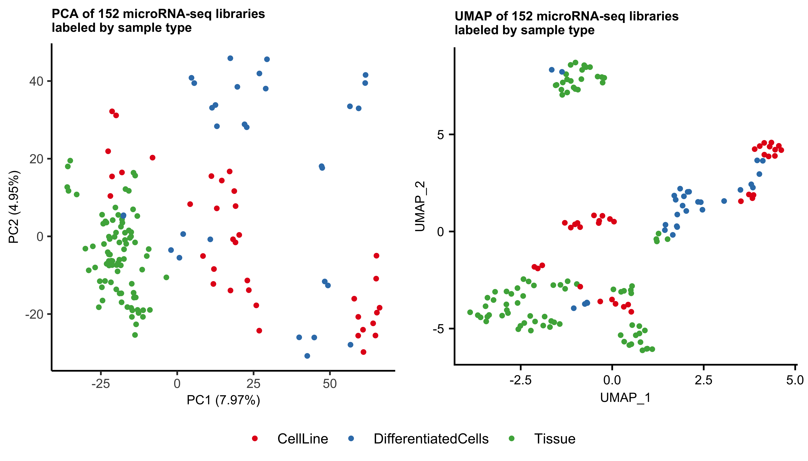

##  Final Project Report
#### Elisabeth Rebboah
#### Eco Evo 282
#### December 16, 2020
***
## Methods
MicroRNA-seq is a form of RNA-seq that captures small, functional RNAs using a 3' adaptor that binds specifically to their 3' hydroxyl group, as oppposed to mRNA-seq that often relies on a 3' poly-A tail.

The libraries are processed by trimming the long adapters on the 3' and 5' ends using cutadapt, leaving around 22 base pairs to be mapped to the genome and quantified using STAR. The ENCODE quality control standards require at least 5 million mapped/multi-mapped reads, at least 300 microRNAs expressed over 2 counts per million (CPM), and a Spearman correlation > 0.85 if there are biological replicates.

The tsv files containing quantifications for 152 human microRNA-seq libraries available on the [ENCODE website](https://www.encodeproject.org/matrix/?type=Experiment&status=released&perturbed=false&assay_title=microRNA-seq&replicates.library.biosample.donor.organism.scientific_name=Homo+sapiens&award.rfa=ENCODE3&award.rfa=ENCODE4&perturbed=true&status=submitted) were downloaded. A detailed metadata file used throughout this project found in the data folder was used to combine the libraries into one counts matrix of 152 samples by 1,881 microRNAs (hg38 GENCODE v29). Counts were also converted to CPM and filtered such that each microRNA had at least 2 CPM in at least one sample, leaving 1,055 microRNAs. The scripts used to generate counts matrices and CPM matrices can be found in code/analysis and are called make_counts_matrices.R and make_cpm_matrices.R, respectively, and the R data/csv files can be found in data/processed. 

Principal component analyis (PCA) was run on this CPM>2 matrix containing all samples, as well as on tissues only (86 samples) and cell lines/differentiated cell lines only (66 samples). In order to represent more variance and have a better understanding of the clusters, a non-linear dimensionality reduction method called Uniform Manifold Approximation and Projection (UMAP) was also implemented on the counts matrices via the Seurat workflow. This workflow normalizes the data, hence why raw counts were used. The script used to generate PCA and UMAP plots can be found in code/analysis and is called pca_umap_figures.R.     

Based on PCA and UMAP analysis, differential expression (DE) analysis using edgeR was carried out on heart tissue samples compared to all other tissues as well as stem cells compared to all other cell line/differentiated cell line samples. 

## Results
PCA of all 152 samples shows that samples mainly cluster together based on if the RNA was isolated from from tissues versus cell lines and differentiated cell lines. This could be caused by differing RNA quality between samples; due to the experimental processing, microRNA-seq performs better on high-quality (RIN>8) RNA. In comparison, the UMAP clusters are more tightly grouped by tissue type. For example, the UMAP shows the myocyte differentiated cells cluster closely to muscle and heart tissues, while this distinction is less clear in the PCA.

The differentially expressed microRNAs are indicated in the following volcano plots.

## Discussion
As an initial exploratory analysis, all microRNA-seq samples were projected in low-dimensionality spaces. MicroRNAs expressed in samples from similar derived/simulated tissues that clustered together and apart from other samples are likely to be tissue-specific. The central role of muscle-specific microRNAs could be why the muscle samples form their own cluster. In addition, microRNAs have been implicated to have a role in stem cell self-renewal, possibly reflected by the hESC/iPSC samples clustering together. 
