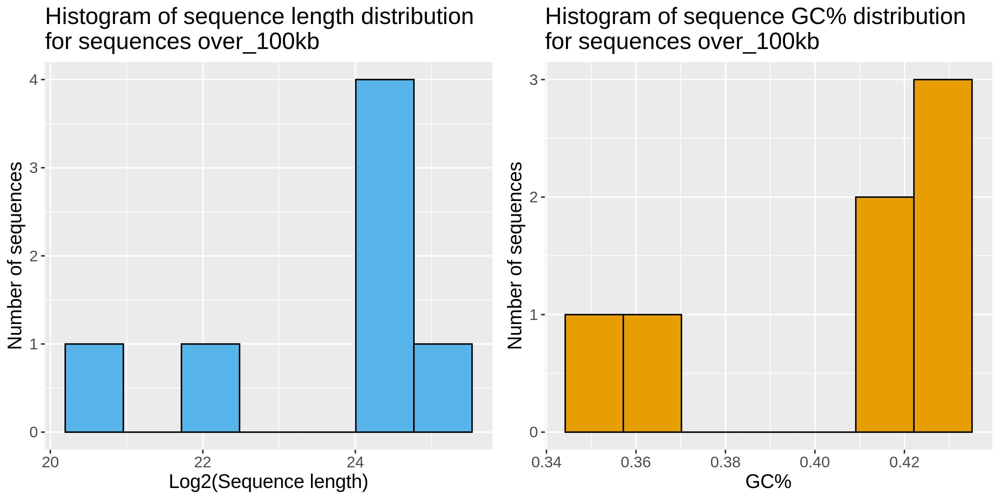
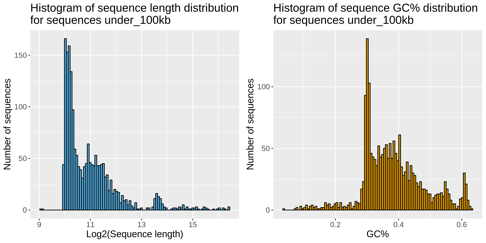

##  Homework 4
#### Elisabeth Rebboah
#### Eco Evo 282
#### December 11, 2020
***
## Summarize partitions of a genome assembly
### Calculations
First, start an interactive session and activate the class conda environment. Download the current Drosophila melanogaster genome for all chromosomes and unzip it. The genome is partitioned into sequences ≤ 100kb and > 100kb and saved as separate files. Next, use faSize to summarize the two different partitions.
```
srun -A ecoevo282 --pty --x11 bash -i
conda activate ee282

wget ftp://ftp.flybase.net/genomes/Drosophila_melanogaster/current/fasta/dmel-all-chromosome-r6.36.fasta.gz
gunzip dmel-all-chromosome-r6.36.fasta.gz

bioawk -c fastx 'length($seq) <= 100000 { print ">"$name; print $seq }' dmel-all-chromosome-r6.36.fasta > dmel-all-chromosome-r6.36.under100kb.fasta
bioawk -c fastx 'length($seq) > 100000 { print ">"$name; print $seq }' dmel-all-chromosome-r6.36.fasta > dmel-all-chromosome-r6.36.over100kb.fasta

faSize dmel-all-chromosome-r6.36.under100kb.fasta
6178042 bases (662593 N's 5515449 real 5515449 upper 0 lower) in 1863 sequences in 1 files
Total size: mean 3316.2 sd 7116.2 min 544 (211000022279089) max 88768 (Unmapped_Scaffold_8_D1580_D1567) median 1567
N count: mean 355.7 sd 1700.6
U count: mean 2960.5 sd 6351.5
L count: mean 0.0 sd 0.0
%0.00 masked total, %0.00 masked real

faSize dmel-all-chromosome-r6.36.over100kb.fasta
137547960 bases (490385 N's 137057575 real 137057575 upper 0 lower) in 7 sequences in 1 files
Total size: mean 19649708.6 sd 12099037.5 min 1348131 (4) max 32079331 (3R) median 23542271
N count: mean 70055.0 sd 92459.2
U count: mean 19579653.6 sd 12138278.9
L count: mean 0.0 sd 0.0
%0.00 masked total, %0.00 masked real
```
First, for under 100kb:

1. There are 6,178,042 nucleotides.  
2. There are 662,593 Ns.
3. There are 1,863 sequences.

Second, for over 100kb:

1. There are 137,547,960 nucleotides. 
2. There are 490,385 Ns
3. There are 7 sequences.

### Plots
Using bioawk, find the lengths and GC% of each sequence and print into statistics files for each partition. Call R script to generate histogram plots for each partition specifying bin number. 
```
bioawk -c fastx '{print $name "\t" length($seq) "\t" gc($seq)}' dmel-all-chromosome-r6.36.over100kb.fasta > stats_over100kb.txt
bioawk -c fastx '{print $name "\t" length($seq) "\t" gc($seq)}' dmel-all-chromosome-r6.36.under100kb.fasta > stats_under100kb.txt

Rscript hist_cdf_plots.R -d stats_over100kb.txt -o . -b 7 -n over_100kb
Rscript hist_cdf_plots.R -d stats_under100kb.txt -o . -b 100 -n under_100kb
```



Use bioawk again to get the lengths of each sequence, sort by descending, and use plotCDF tool to generate cumulative distribution plots for each partition. R script can be found in code/scripts 
```
bioawk -c fastx '{print length($seq) }' dmel-all-chromosome-r6.36.over100kb.fasta | sort -r  > lengths_over100kb.txt
plotCDF lengths_over100kb.txt cdf_over_100kb.png

bioawk -c fastx '{print length($seq) }' dmel-all-chromosome-r6.36.under100kb.fasta | sort -r  > lengths_under100kb.txt
plotCDF lengths_under100kb.txt cdf_under_100kb.png
```
Over 100kb:


Under 100kb:


## Genome assembly
### Assemble a genome from MinION reads
Download and unzip sequence data, then use minimap2 to find all-vs-all overlaps between Oxford Nanopore reads. Miniasm finds the order of the read overlaps and outputs a GFA (graphical fragment assembly) file.
```
srun -c 32 -A ecoevo282 --pty --x11 bash -i
conda activate ee282

wget https://hpc.oit.uci.edu/~solarese/ee282/iso1_onp_a2_1kb.fastq.gz
gunzip iso1_onp_a2_1kb.fastq.gz

basedir=~/
projname=nanopore_assembly
basedir=$basedir
raw=$basedir/$projname/data/raw
processed=$basedir/$projname/data/processed

createProject $projname $basedir

ln -sf /data/homezvol2/erebboah/hw4/iso1_onp_a2_1kb.fastq $raw/reads.fq

minimap2 -x ava-ont -t8 $raw/reads.fq{,} \
| gzip -1 \
> $processed/onp.paf.gz

miniasm -f $raw/reads.fq $processed/onp.paf.gz \
> $processed/assembly.gfa
```

### Assembly assessment
#### N50 calculation
The N50 code provided in class is defined as follows, which takes in a fasta file and uses bioawk and gawk to find the N50. To calculate the N50 of the data, use awk to convert the GFA file to a fasta file and use tee to simultaneously run the N50 function on the fasta file. The output is redirected to the reports directory, and the fasta file is written to the processed directory.
```
srun -A ecoevo282 --pty --x11 bash -i
conda activate ee282

basedir=~/
projname=nanopore_assembly
basedir=$basedir
processed=$basedir/$projname/data/processed
reports=$basedir/$projname/output/reports

n50 () {
  bioawk -c fastx ' { print length($seq); n=n+length($seq); } END { print n; } ' $1 \
  | sort -rn | head
  | gawk ' NR == 1 { n = $1 }; NR > 1 { ni = $1 + ni; } ni/n > 0.5 { print $1; exit; } '
}

awk ' $0 ~/^S/ { print ">" $2" \n" $3 } ' $processed/assembly.gfa \
| tee >(n50 /dev/stdin > $reports/n50.txt) \
| fold -w 60 \
> $processed/unitigs.fa
```
The N50 of this assembly is **7,900,283**, compared to the *Drosophila* FlyBase contig N50 which is **21,485,538**.

#### Comparing assembly to both the contig assembly and the scaffold assembly
Use the FIFO example from class to generate a contiguity plot comparing the Oxford Nanopore contig assembly (ONT_Ctg) to the FlyBase *Drosophila* [community reference](https://www.ncbi.nlm.nih.gov/assembly/GCF_000001215.4) contig/scaffold assembly (FB_Ctg/FB_Scaff).
```
srun -A ecoevo282 --pty --x11 bash -i
conda activate ee282

basedir=~/
projname=nanopore_assembly
basedir=$basedir
raw=$basedir/$projname/data/raw
processed=$basedir/$projname/data/processed
figures=$basedir/$projname/output/figures
reports=$basedir/$projname/output/reports
ont_data=$processed/unitigs.fa

cd $basedir/nanopore_assembly

r6url="https://ftp.ncbi.nlm.nih.gov/genomes/all/GCA/000/001/215/GCA_000001215.4_Release_6_plus_ISO1_MT/GCA_000001215.4_Release_6_plus_ISO1_MT_genomic.fna.gz"

mkfifo tmp/{r6scaff,r6ctg,ont}_fifo

wget -O - -q $r6url \
| tee >( \
  bioawk -c fastx ' { print length($seq) } ' \
  | sort -rn \
  | awk ' BEGIN { print "Assembly\tLength\nFB_Scaff\t0" } { print "FB_Scaff\t" $1 } ' \
  > tmp/r6scaff_fifo & ) \
| faSplitByN /dev/stdin /dev/stdout 10 \
| bioawk -c fastx ' { print length($seq) } ' \
| sort -rn \
| awk ' BEGIN { print "Assembly\tLength\nFB_Ctg\t0" } { print "FB_Ctg\t" $1 } ' \
> tmp/r6ctg_fifo &

bioawk -c fastx ' { print length($seq) } ' $ont_data \
| sort -rn \
| awk ' BEGIN { print "Assembly\tLength\nONT_Ctg\t0" } { print "ONT_Ctg\t" $1 } ' \
> tmp/ont_fifo &

plotCDF2 tmp/{r6scaff,r6ctg,ont}_fifo /dev/stdout \
| tee $figures/r6_v_ont.png \
| display 

rm tmp/{r6scaff,r6ctg,ont}_fifo
```


```
#### BUSCO scores
Download BUSCO pipeline from bioconda and [lineage data](https://busco-data.ezlab.org/v4/data/lineages/) for order *Diptera*. First run busco on the ONT assembly, then on the FlyBase assembly.
```
srun -c 16 -A ecoevo282 --pty --x11 bash -i
conda activate ee282

conda install -c bioconda busco

basedir=~/
projname=nanopore_assembly
basedir=$basedir
processed=$basedir/$projname/data/processed

mkdir $basedir/$projname/data/ref
cd $basedir/$projname/data/ref

wget https://busco-data.ezlab.org/v4/data/lineages/diptera_odb10.2020-08-05.tar.gz
tar -xvf diptera_odb10.2020-08-05.tar.gz
wget https://ftp.ncbi.nlm.nih.gov/genomes/all/GCA/000/001/215/GCA_000001215.4_Release_6_plus_ISO1_MT/GCA_000001215.4_Release_6_plus_ISO1_MT_genomic.fna.gz
gunzip GCA_000001215.4_Release_6_plus_ISO1_MT_genomic.fna.gz

ont_data=$processed/unitigs.fa
lineage=$basedir/$projname/data/ref/diptera_odb10
flybase=$basedir/$projname/data/ref/GCA_000001215.4_Release_6_plus_ISO1_MT_genomic.fna

cd $basedir/$projname/output/reports

run_busco -c 16 -i $ont_data -l $lineage -o ont_data_busco -m genome 
run_busco -c 16 -i $flybase -l $lineage -o flybase_data_busco -m genome 

```
The BUSCO short summary for the ONT assembly is:

	C:0.3%[S:0.3%,D:0.0%],F:1.7%,M:98.0%,n:3285

	9	Complete BUSCOs (C)
	9	Complete and single-copy BUSCOs (S)
	0	Complete and duplicated BUSCOs (D)
	57	Fragmented BUSCOs (F)
	3219	Missing BUSCOs (M)
	3285	Total BUSCO groups searched

in comparison to the BUSCO short summary for the FlyBase assembly:


These results are somewhat concerning, since so many BUSCOs are missing in our assembly. However, it is worth keeping in mind that the FlyBase reference was probably built with a lot more data and carefully managed by the *Drosophila* community, so its BUSCO scores should be a lot higher.


