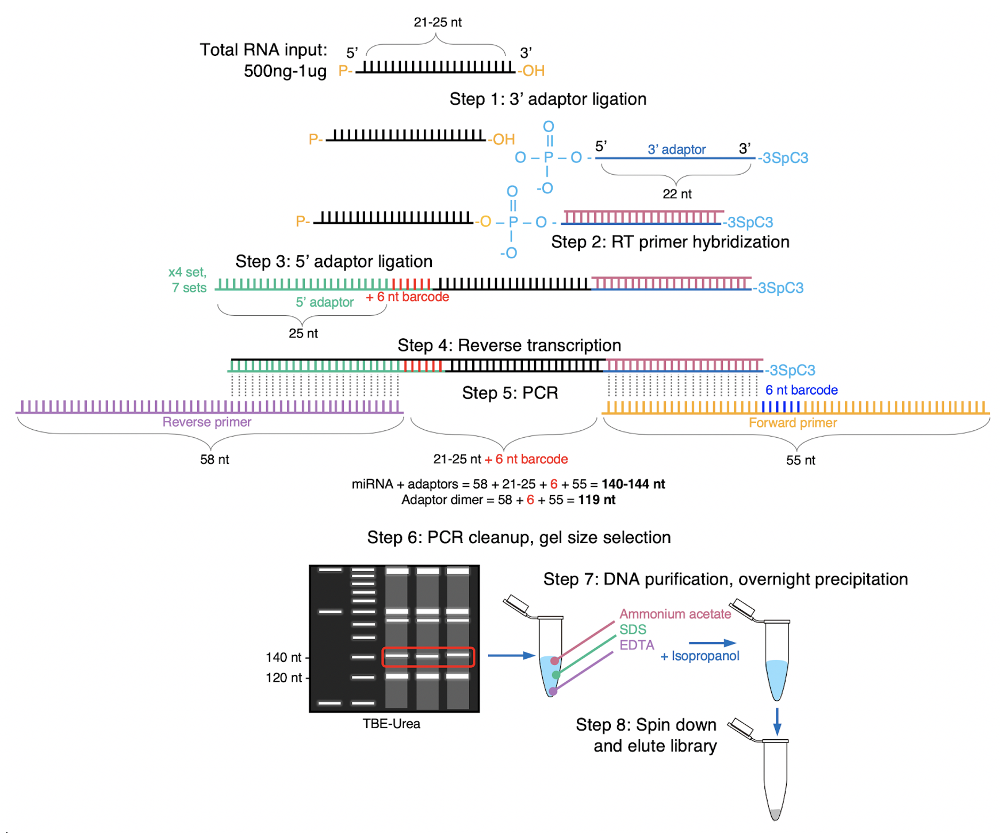

##  Final Project Report
#### Elisabeth Rebboah
#### Eco Evo 282
#### December 16, 2020
***
## Methods
MicroRNA-seq is a form of RNA-seq that captures small, functional RNAs using a 3' adaptor that binds specifically to their 3' hydroxyl group, as oppposed to mRNA-seq that often relies on a 3' poly-A tail.

The libraries are processed by trimming the long adapters on the 3' and 5' ends using cutadapt, leaving around 22 base pairs to be mapped to the genome and quantified using STAR. The ENCODE quality control standards require at least 5 million mapped/multi-mapped reads, at least 300 miRNAs expressed over 2 counts per million (CPM), and a Spearman correlation > 0.85 if there are biological replicates.

The tsv files containing quantifications for all 152 human microRNA-seq libraries available on the [ENCODE website](https://www.encodeproject.org/matrix/?type=Experiment&status=released&perturbed=false&assay_title=microRNA-seq&replicates.library.biosample.donor.organism.scientific_name=Homo+sapiens&award.rfa=ENCODE3&award.rfa=ENCODE4&perturbed=true&status=submitted) were downloaded. A detailed metadata file used throughout this project was used to combine the libraries into one counts matrix of 152 samples by 1,881 microRNAs (hg38 GENCODE v29). Counts were also converted to CPM and filtered such that each microRNA had at least 2 CPM in at least one sample, leaving 1,055 microRNAs. The scripts used to generate counts matrices and CPM matrices are make_counts_matrices.R and make_cpm_matrices.R, respectively. 

Principal component analyis (PCA) was run on this CPM>2 matrix, as well as on CPM>2 matrices for each sample type: cell line (36 samples), differentiatd cells (30 samples), and tissues (86 samples). In order to represent more variance and have a better understanding of the clusters, a non-linear dimensionality reduction method called Uniform Manifold Approximation and Projection (UMAP) was also implemented on the counts matrices via the Seurat workflow. The UMAP method normalizes the data, hence why counts were used. The scripts used to generate PCA and UMAP plots are pca_figures.R and umap_figures.R, respectively.      

## Results

